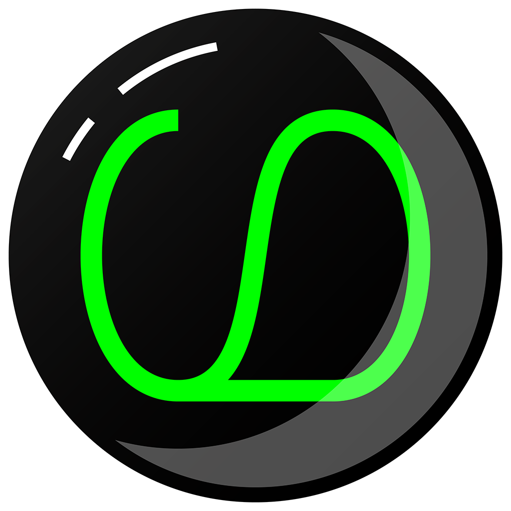
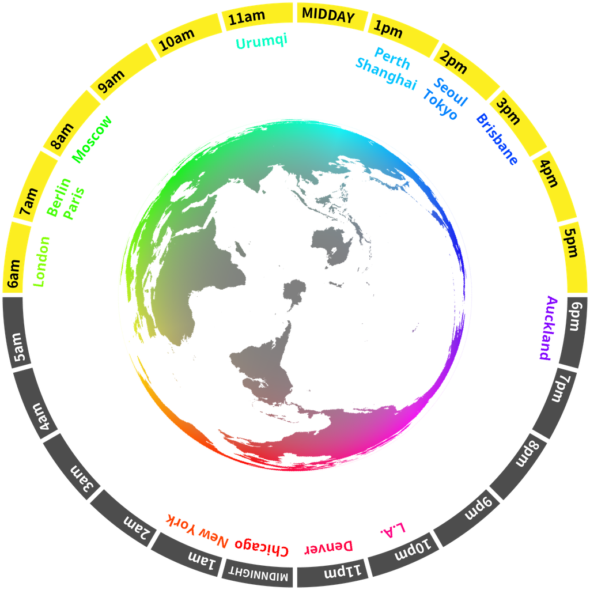

***

<h1 align="center">

    

&nbsp;
Gorialis
</h1>

Hello! I like making tangible software.

***

My name is Devon and this is where you can view my public projects. I have a mix of stable and experimental projects, as well as some more comedic repositories.

I work in a handful of different disciplines, but my recent work tends mostly towards reverse engineering, DevOps, and graphical/UX design.

As a fun demonstration of what I can do, this README *dynamically regenerates* using GitHub Actions every hour! (it last updated at **07:10 UTC, 2020-12-18**)

<h2>JLPT words of the hour</h2>
<table>
    <tr>
        <th>JLPT N1</th>
        <th>JLPT N2</th>
        <th>JLPT N3</th>
        <th>JLPT N4</th>
        <th>JLPT N5</th>
    </tr>
    <tr>
        <td>
            
とぎれる

            <h3 align="center"><b><a href="https://jisho.org/search/%E3%81%A8%E3%81%8E%E3%82%8C%E3%82%8B">とぎれる</a></b></h3>
            

            
to pause,<wbr> to be interrupted

        </td>
        <td>
            
ようひんてん

            <h3 align="center"><b><a href="https://jisho.org/search/%E6%B4%8B%E5%93%81%E5%BA%97">洋品店</a></b></h3>
            

            
clothes store

        </td>
        <td>
            
あな

            <h3 align="center"><b><a href="https://jisho.org/search/%E7%A9%B4">穴</a></b></h3>
            

            
hole

        </td>
        <td>
            
くうこう

            <h3 align="center"><b><a href="https://jisho.org/search/%E7%A9%BA%E6%B8%AF">空港</a></b></h3>
            

            
airport

        </td>
        <td>
            
かいもの

            <h3 align="center"><b><a href="https://jisho.org/search/%E8%B2%B7%E3%81%84%E7%89%A9">買い物</a></b></h3>
            

            
shopping

        </td>
    </tr>
</table>

<h2>Other things</h2>

🕖  World clock inspired by <a href="https://xkcd.com/now">XKCD now</a>

> 

🌒 Lunar phase

The moon is approximately 14.30% through its phase (Waxing Crescent).

&#x1f5bc; Fractal of the hour

> 

&#x23f2; Year percentage bar

<pre><code>2020 [███████████████████▁] 96.26%</code></pre>

