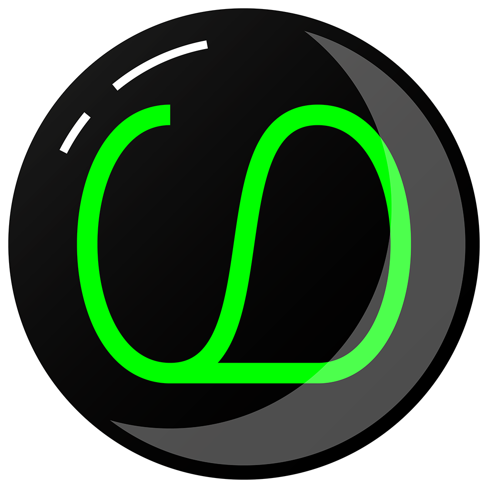
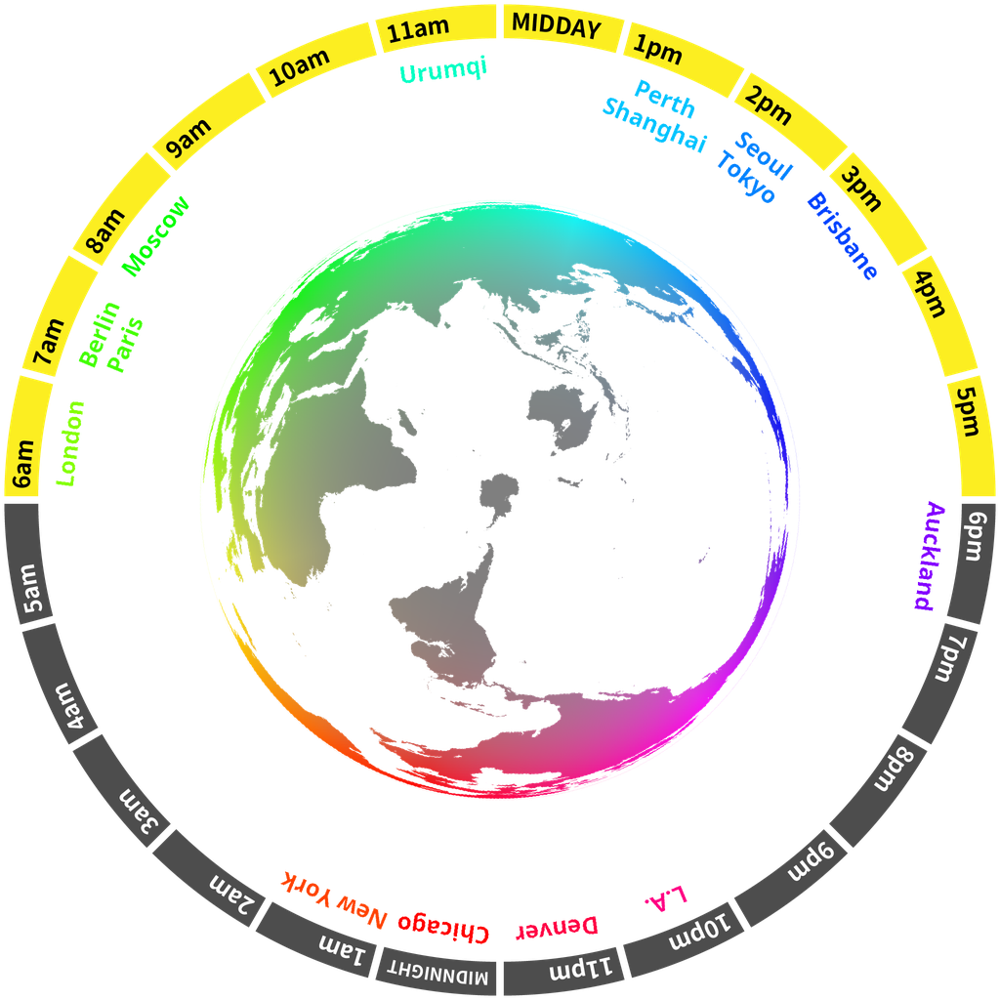
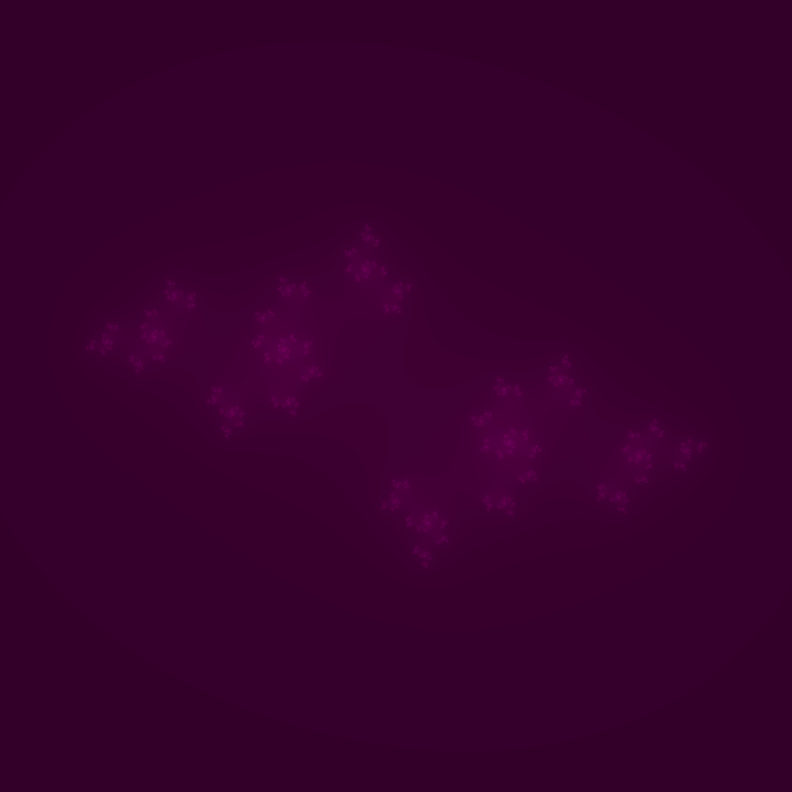

***

<h1 align="center">

    

&nbsp;
Gorialis
</h1>

Hello! I like making tangible software.

***

My name is Devon and this is where you can view my public projects. I have a mix of stable and experimental projects, as well as some more comedic repositories.

I work in a handful of different disciplines, but my recent work tends mostly towards reverse engineering, DevOps, and graphical/UX design.

As a fun demonstration of what I can do, this README *dynamically regenerates* using GitHub Actions every hour! (it last updated at **03:09 UTC, 2021-03-19**)

<h2>JLPT words of the hour</h2>
<table>
    <tr>
        <th>JLPT N1</th>
        <th>JLPT N2</th>
        <th>JLPT N3</th>
        <th>JLPT N4</th>
        <th>JLPT N5</th>
    </tr>
    <tr>
        <td>
            
まっぷたつ

            <h3 align="center"><b><a href="https://jisho.org/search/%E7%9C%9F%E3%81%A3%E4%BA%8C%E3%81%A4">真っ二つ</a></b></h3>
            

            
in two equal parts

        </td>
        <td>
            
やわらかい

            <h3 align="center"><b><a href="https://jisho.org/search/%E8%BB%9F%E3%82%89%E3%81%8B%E3%81%84">軟らかい</a></b></h3>
            

            
soft,<wbr> tender,<wbr> limp

        </td>
        <td>
            
あんてい

            <h3 align="center"><b><a href="https://jisho.org/search/%E5%AE%89%E5%AE%9A">安定</a></b></h3>
            

            
stability,<wbr> equilibrium

        </td>
        <td>
            
スーツケース

            <h3 align="center"><b><a href="https://jisho.org/search/%E3%82%B9%E3%83%BC%E3%83%84%E3%82%B1%E3%83%BC%E3%82%B9">スーツケース</a></b></h3>
            

            
suitcase

        </td>
        <td>
            
にもつ

            <h3 align="center"><b><a href="https://jisho.org/search/%E8%8D%B7%E7%89%A9">荷物</a></b></h3>
            

            
luggage;  baggage

        </td>
    </tr>
</table>

<h2>Other things</h2>

🕒  World clock inspired by <a href="https://xkcd.com/now">XKCD now</a>

> 

🌓 Lunar phase

The moon is approximately 21.89% through its phase (First Quarter).

&#x1f5bc; Fractal of the hour

> 

&#x23f2; Year percentage bar

<pre><code>2021 [████▁▁▁▁▁▁▁▁▁▁▁▁▁▁▁▁] 21.13%</code></pre>

