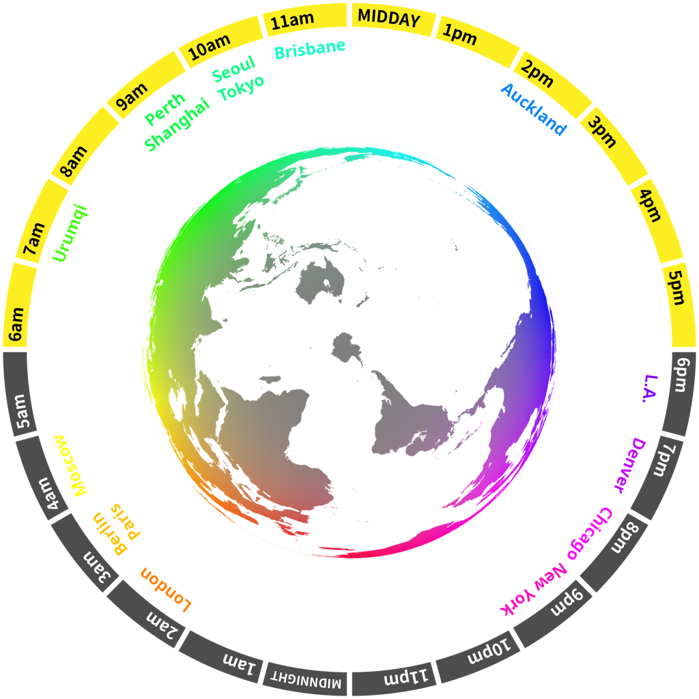

***

<h1 align="center">

    

&nbsp;
Gorialis
</h1>

Hello! I like making tangible software.

***

My name is Devon and this is where you can view my public projects. I have a mix of stable and experimental projects, as well as some more comedic repositories.

I work in a handful of different disciplines, but my recent work tends mostly towards reverse engineering, DevOps, and graphical/UX design.

As a fun demonstration of what I can do, this README *dynamically regenerates* using GitHub Actions every hour! (it last updated at **16:21 UTC, 2020-12-24**)

<h2>JLPT words of the hour</h2>
<table>
    <tr>
        <th>JLPT N1</th>
        <th>JLPT N2</th>
        <th>JLPT N3</th>
        <th>JLPT N4</th>
        <th>JLPT N5</th>
    </tr>
    <tr>
        <td>
            
よかん

            <h3 align="center"><b><a href="https://jisho.org/search/%E4%BA%88%E6%84%9F">予感</a></b></h3>
            

            
presentiment,<wbr> premonition

        </td>
        <td>
            
そくたつ

            <h3 align="center"><b><a href="https://jisho.org/search/%E9%80%9F%E9%81%94">速達</a></b></h3>
            

            
express,<wbr> special delivery

        </td>
        <td>
            
せんこう

            <h3 align="center"><b><a href="https://jisho.org/search/%E5%B0%82%E6%94%BB">専攻</a></b></h3>
            

            
major subject,<wbr> special study

        </td>
        <td>
            
なるべく

            <h3 align="center"><b><a href="https://jisho.org/search/%E3%81%AA%E3%82%8B%E3%81%B9%E3%81%8F">なるべく</a></b></h3>
            

            
if possible,<wbr> as much as possible

        </td>
        <td>
            
やさい

            <h3 align="center"><b><a href="https://jisho.org/search/%E9%87%8E%E8%8F%9C">野菜</a></b></h3>
            

            
vegetable

        </td>
    </tr>
</table>

<h2>Other things</h2>

🕓  World clock inspired by <a href="https://xkcd.com/now">XKCD now</a>

> 

🌔 Lunar phase

The moon is approximately 35.91% through its phase (Waxing Gibbous).

&#x1f5bc; Fractal of the hour

> 

&#x23f2; Year percentage bar

<pre><code>2020 [███████████████████▁] 98.00%</code></pre>

